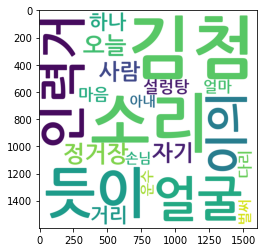

# DOCX, HWP, PDF 파일을 한꺼번에 분석하기

다양한 문서 형식(docx, hwp, pdf)을 한꺼번에 분석하는 파이썬 예제 코드입니다. (ipynb)

아래와 같이 3종류의 파이썬 패키지(pypandoc, pyhwp, pdfminer)를 설치한 뒤,

```
!pip install pypandoc
!pip install pyhwp
!pip install pdfminer
```

각 파일을 일단 텍스트(txt) 파일로 변환하여 저장하고, 변환된 텍스트 파일들을 분석합니다.

이 예제에서는 간단한 워드 클라우드를 만들어 보겠습니다.

샘플 문서로 만료저작물인 현진건의 '운수 좋은 날' 텍스트를 'sample_data' 폴더에 업로드하여 사용합니다.

(구글 Colab에서 돌리는 경우를 상정하였습니다.)

- 현진건-운수_좋은_날+B3356-개벽.docx
- 현진건-운수_좋은_날+B3356-개벽.hwp
- 현진건-운수_좋은_날+B3356-개벽.pdf

한국어 워드 클라우드 생성에 나눔고딕볼드 폰트를 GitHub 리포지토리에서 가져와서 사용합니다.

https://github.com/ujuc/nanum-font/blob/master/ttf/NanumGothicBold.ttf?raw=true

아래는 워드 클라우드 출력 결과입니다.


